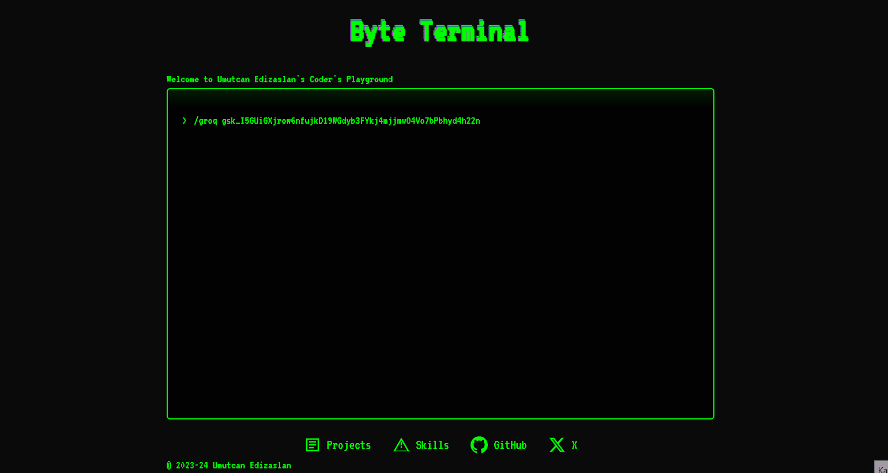

# Byte Terminal

Welcome to Byte Terminal - Umutcan Edizaslan's Coder's Playground!



## Overview

Byte Terminal is an interactive web-based chat interface that allows users to communicate with AI models using the Groq API. It provides a sleek, terminal-like experience with customizable features, local storage capabilities, and now includes Retrieval-Augmented Generation (RAG) functionality for PDF documents.
You can try it at [https://uc4n.com](https://uc4n.com)

## Features

- **AI Chat Interface**: Interact with AI models through a user-friendly terminal-like interface.
- **Groq API Integration**: Seamlessly connect with Groq's powerful AI models.
- **Local Storage**: Save API keys, model preferences, and chat history locally in the browser.
- **Customizable Commands**: Use built-in commands to manage your experience.
- **Syntax Highlighting**: Enjoy color-coded outputs for better readability.
- **Conversation Export**: Save your chat history as a JSON file.
- **Text Formatting**: 
  - Model names are displayed in blue.
  - AI responses are displayed in white.
  - Text enclosed in double asterisks (`**like this**`) is displayed in blue and bold.
- **PDF RAG**: Upload PDF documents (up to 15MB) and chat with their content using Retrieval-Augmented Generation.
- **RAG History**: View a table of all uploaded PDF files with their details.

## Usage

### Setting Up

1. Set your Groq API key:
   ```
   /groq your-api-key-here
   ```

2. Set your preferred model:
   ```
   /model model-name-here
   ```

### Commands

- `/help`: Display available commands
- `/groq <key>`: Set the API key
- `/model <name>`: Set the model name
- `/deletea`: Delete the stored API key
- `/deletem`: Delete the stored model name
- `/clear`: Clear the terminal
- `/save`: Save the conversation history as JSON
- `/upload`: Upload a PDF file for RAG functionality
- `/historyofrag`: Display a table of uploaded PDF files with their details

### Chatting

Once you've set up your API key and model, simply type your message and press Enter to chat with the AI. 

### Using RAG with PDF Documents

1. Type `/upload` in the terminal.
2. Select a PDF file (up to 15MB) when prompted.
3. Wait for the PDF to be processed. You'll see a confirmation message.
4. Start asking questions about the PDF content. The AI will use the document information to provide more contextual and accurate answers.
5. To view a history of all uploaded PDFs, use the `/historyofrag` command.

**Note on Formatting**: If you want to emphasize part of your message, you can enclose it in double asterisks. For example, typing "This is **important**" will display "important" in blue and bold in the chat interface.

## Customization

You can customize the appearance of Byte Terminal by modifying the CSS in the <style> section of index.html.

## Contributing

Contributions are welcome! Please feel free to submit a Pull Request.

## License

This project is licensed under the MIT License - see the [LICENSE](LICENSE) file for details.

## Acknowledgments

- Thanks to Groq for providing the AI API.
- Special thanks to all contributors and users of Byte Terminal.

## Author

<p align="left">
<b>Umutcan Edizaslan:</b>
<a href="https://github.com/U-C4N" target="blank"></a>
<a href="https://x.com/UEdizaslan" target="blank"></a>
</p>
